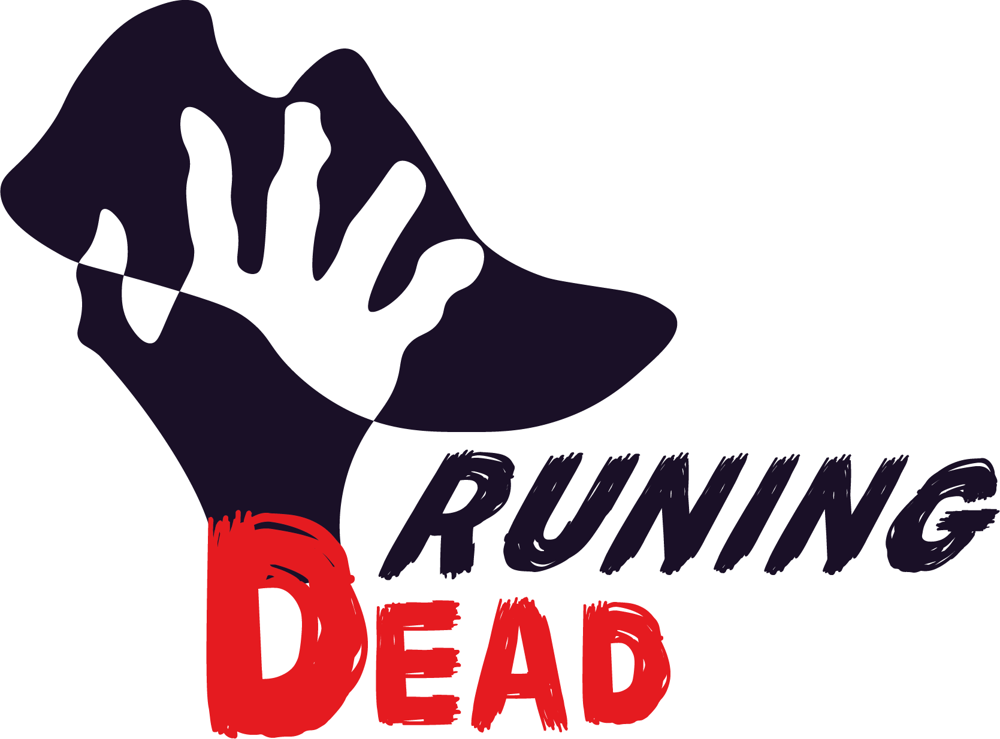

Accédez à RunningDead en ligne ici : [RunningDead sur GitHub Pages](https://marielef291.github.io/RunningDead/).

*For English version, click [here](#english-version)*

**RunningDead** est né de notre expérience lors d'une Course d’Orientation (CO) zombie, un événement où l'objectif n'est pas seulement de trouver les balises, mais aussi d’éviter de perdre des points en se faisant attraper par les zombies en chemin. Contrairement aux courses classiques, les zombies nous poursuivent sans temps de repos, ce qui rend l’entraînement avec des applications de running traditionnelles peu adapté pour se préparer à une CO zombie. RunningDead a donc été conçu pour simuler cette expérience en développant à la fois la rapidité des sprints et la réactivité des coureurs.

## Objectif de l'application

L'objectif de RunningDead est simple : vous préparer à réagir et courir avant qu'un zombie ne vous attrape. Le but est de réaliser des sprints de 50, 100 ou 200 mètres en réponse à un signal sonore aléatoire indiquant l'apparition d'un zombie. À chaque signal, le chronomètre se déclenche, et votre mission est de réagir et terminer le sprint aussi rapidement que possible. Plus vous êtes rapide et réactif, plus vous serez prêt pour une véritable course d'orientation zombie.

## Fonctionnalités principales

- **Simulation d’une CO zombie** : Sprints chronométrés déclenchés par des alertes sonores aléatoires.
- **Options de personnalisation** : Choix de distance pour les sprints (50, 100, 200 mètres) pour adapter l'entraînement.
- **Stockage des préférences utilisateur** : Enregistrement local des choix et des résultats via `localStorage`.
- **Mode sombre** : Option de thème sombre pour un confort visuel accru.

## Auteurs

RunningDead est le fruit d'une collaboration entre :

- **Marie Lefebvre** : Responsable du développement JavaScript, incluant le questionnaire, le stockage des données, et le chronomètre.
- **Fabrice Richebe** : Créateur du design et du logo, en charge de l'interface utilisateur, des choix esthétiques, et de la structure visuelle pour une navigation intuitive.

---

# English Version

[RunningDead](https://marielef291.github.io/RunningDead/) was inspired by our experience participating in a zombie orienteering race, where the goal wasn’t just to reach checkpoints but also to avoid losing points by getting caught by zombies. Unlike traditional races, these zombies pursue without rest, making standard running apps insufficient for training for a zombie orienteering event. RunningDead aims to replicate this experience, training both sprint speed and reactivity.

## Application Purpose

The goal of RunningDead is simple: to train you to react and run before a zombie catches you. The app challenges you to complete sprints of 50, 100, or 200 meters in response to a random sound signal indicating a zombie’s appearance. Each signal triggers a timer, and your mission is to react and complete the sprint as quickly as possible. The faster and more responsive you are, the better prepared you’ll be for an actual zombie orienteering race.

## Key Features

- **Zombie orienteering simulation**: Timed sprints triggered by random sound alerts.
- **Customization options**: Choose distances for sprints (50, 100, 200 meters) for tailored training.
- **User preferences storage**: Local storage of settings and results via `localStorage`.
- **Dark mode**: An optional dark theme for improved visual comfort.

## Authors

RunningDead is the product of a collaborative effort between:

- **Marie Lefebvre**: JavaScript development, including questionnaire logic, data storage, and timer.
- **Fabrice Richebe**: Design and logo, responsible for the user interface, aesthetic choices, and visual structure for intuitive navigation.
